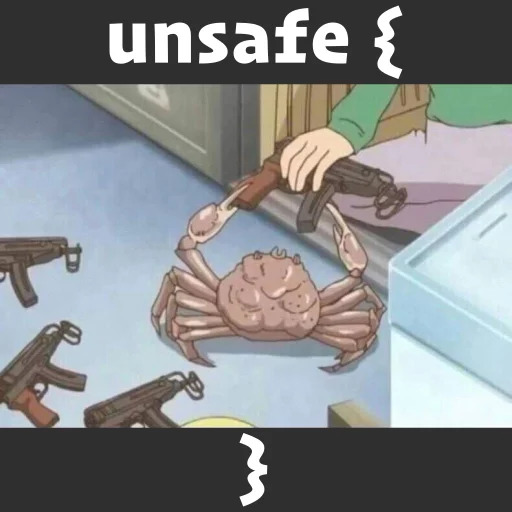

# Simple file watchdog

This little project is an excuse to learn about unsafe Rust and the bindings between C and the language. It works on Unix and Windows platforms.

  

### Ressources
- [Rustonomicon](https://doc.rust-lang.org/nomicon/)
- [Understanding ReadDirectoryChangesW](https://qualapps.blogspot.com/2010/05/understanding-readdirectorychangesw_19.html) blog post from Jim Beveridge

